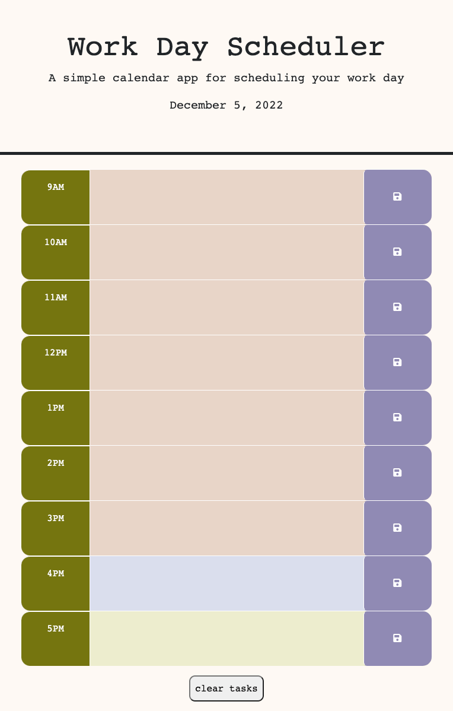

# task-tracker-2000

## Description

I wanted to create a workday planner that color-codes past, present, and future time-blocks, and displays saved tasks when the page is loaded. For loops were helpful in getting elements from the HTML as well as setting the text content for time-blocks with saved tasks. I also practiced using jQuery, which helped to keep the script file more concise.

## Table of Contents (Optional)

- [Usage](#usage)
- [Credits](#credits)
- [License](#license)

## Usage

To use the scheduler, simply enter a task in the text area of the desired timeblock. The timeblocks are highlighted different colors for past, present, and future timeblocks. To save a task, click the button with the save icon to the right of the text area. Saved tasks will display automatically when page loads. To clear a task, delete text from textbox and save. Or, click the button located below scheduler to clear entire form and delete saved tasks from local storage.

[Deployed application](https://rbkeyes.github.io/task-tracker-2000/)

[Github Link](https://github.com/rbkeyes/task-tracker-2000)
    
    

## Credits

Examples of Work Day Schedule projects by other students:
https://github.com/EdenKhaos/05-work-day-scheduler

https://github.com/JulieAnn2330/work-day-scheduler/blob/master/index.html

jQuery documentation:
[.click()](https://api.jquery.com/click/)

[.siblings()](https://api.jquery.com/siblings/)

[.addClass()](https://api.jquery.com/addClass/)

[.attr()](https://api.jquery.com/attr/)

w3schools:
[w3schools "this"](https://www.w3schools.com/js/js_this.asp)

[localStorage.clear()](https://www.w3schools.com/jsref/met_storage_clear.asp)

## License

MIT License

Copyright (c) 2022 Reed Keyes

Permission is hereby granted, free of charge, to any person obtaining a copy
of this software and associated documentation files (the "Software"), to deal
in the Software without restriction, including without limitation the rights
to use, copy, modify, merge, publish, distribute, sublicense, and/or sell
copies of the Software, and to permit persons to whom the Software is
furnished to do so, subject to the following conditions:

The above copyright notice and this permission notice shall be included in all
copies or substantial portions of the Software.

THE SOFTWARE IS PROVIDED "AS IS", WITHOUT WARRANTY OF ANY KIND, EXPRESS OR
IMPLIED, INCLUDING BUT NOT LIMITED TO THE WARRANTIES OF MERCHANTABILITY,
FITNESS FOR A PARTICULAR PURPOSE AND NONINFRINGEMENT. IN NO EVENT SHALL THE
AUTHORS OR COPYRIGHT HOLDERS BE LIABLE FOR ANY CLAIM, DAMAGES OR OTHER
LIABILITY, WHETHER IN AN ACTION OF CONTRACT, TORT OR OTHERWISE, ARISING FROM,
OUT OF OR IN CONNECTION WITH THE SOFTWARE OR THE USE OR OTHER DEALINGS IN THE
SOFTWARE.

